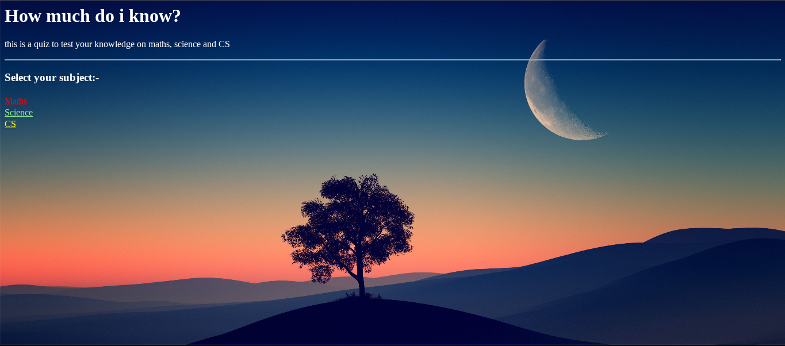
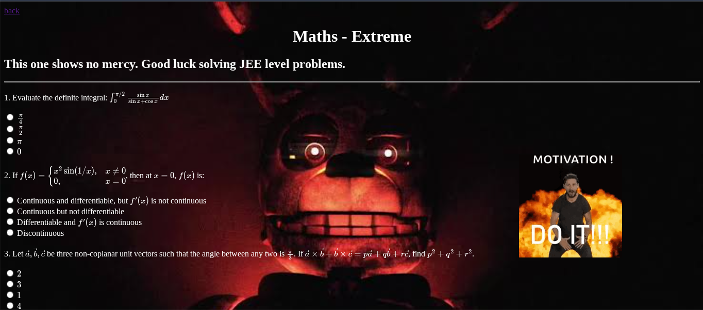

# How much do i know?

## what is this??
this is a simple quiz website made with html css and js.
I used mathjax library to render mathematical symbols. It uses latex syntax

## how to run?
go to this [link](https://pahal-desai.github.io/quiz/)
PS - try the extreme modes. they're going to eat you alive :)

## what did I learn from this project?
this project made me learn some basic js & latex (mathjax).
Most importantlly, i learnt that i should research about the language itself before making any project. this could've been done in about 2 hours if i had done it the right way.
I wasted a few hours in the extreme mode to use latex for powers. then i came to know that html has a `` tag.

Screenshots:-

